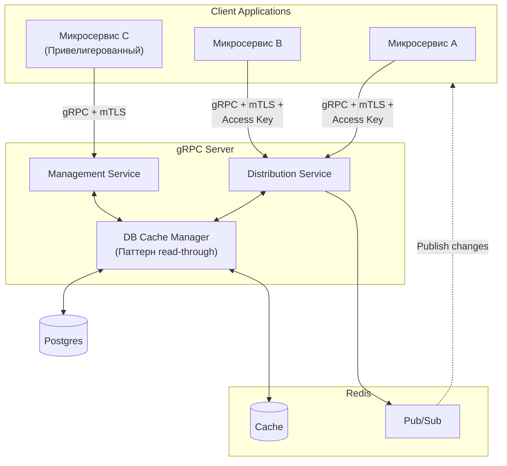

## Envnm

Envnm - система управления переменными окружения с контролем доступа на основе политик. Приложения-клиенты могут получать и изменять переменные окружения в рамках своих групп доступа.

Стек: Go, PostgreSQL, Redis, gRPC

Разрабатывается в соответствии с принципами DDD и чистой архитектуры.

### Основные возможности

- Управление переменными окружения
- Контроль доступа через политики прав на редактирование окружений
- Уведомление приложения подписчика об изменении переменной
- gRPC API для управления и клиентского доступа
- CLI инструмент для администрирования
- Кэширование переменных в Redis
- Prometheus метрики
- Поддержка TLS
- Docker контейнеризация
- Graceful shutdown

### API

Distribution Service (для клиентов приложений)
GetClientVariables — получить переменные
UpdateVariables — обновить переменные (только с правом на изменение)

Management Service (для администраторов)
- Полный CRUD окружений и политик
- Защищён mTLS + Basic Auth
- Есть cli-клиент 

### Метрики

<!-- Доступ к метрикам Prometheus на `/metrics`. Включает метрики для:
- Запросов к API
- Операций с кэшем
- Операций с базой данных -->



### Структура конфигурации

Конфигурация через переменные окружения:

```
HOST=0.0.0.0
PORT=50051
LOG_LEVEL=INFO
POSTGRES_HOST=localhost
POSTGRES_PORT=5432
POSTGRES_DB=postgres
POSTGRES_USER=postgres
POSTGRES_PASSWORD=postgres
REDIS_HOST=localhost
REDIS_PORT=6379
CACHE_TTL=5m
MAX_RETRIES=3
RETRY_TIMEOUT=10s
SEED_KEY=your-secret-key
CA_CERT_PATH=/path/to/ca.crt
CERT_PATH=/path/to/server.crt
KEY_PATH=/path/to/server.key
```

### Запуск

1. **С помощью Docker Compose:**
   ```bash
   docker-compose up
   ```

2. **Локально:**
   ```bash
   make build
   make run
   ```

### Настройка CLI

```bash
# Создание окружения
envmn environment create --name dev --description "Development environment"

# Добавление переменной
envmn variables set --env dev --key DATABASE_URL --value "postgres://..."

# Создание политики доступа
envmn policy create --name read-only --permissions read
```

### API

gRPC сервисы:
- **ManagementService**: для администрирования (требует x-admin-password)
- **ClientService**: для клиентского доступа (требует аутентификации)

