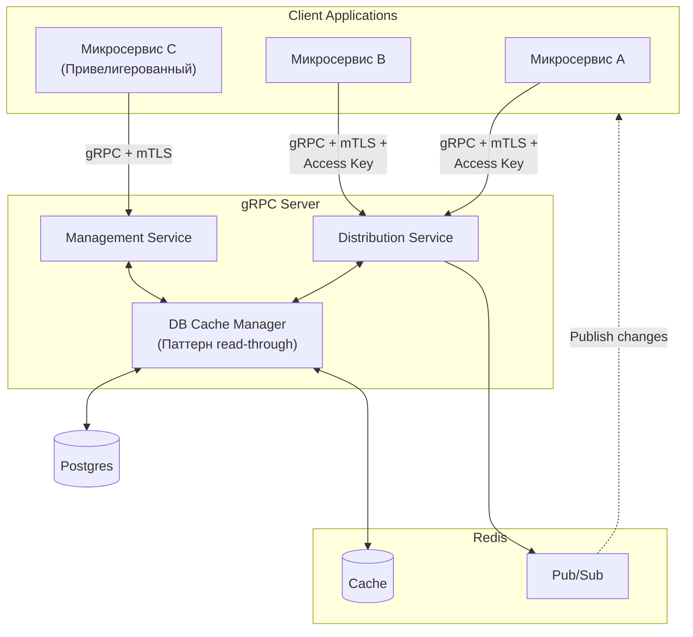

## Envnm

Envnm - система управления переменными окружения с контролем доступа на основе политик. Приложения-клиенты могут получать и изменять переменные окружения в рамках своих групп доступа.

Стек: *Go, PostgreSQL, Redis, gRPC*

Разрабатывается в соответствии с принципами DDD и чистой архитектуры.

Вся бизнес логика покрыта тестами, покрытие - 78.2%.

### Основные возможности

- Управление переменными окружения
- Контроль доступа через политики прав на редактирование окружений
- Уведомление приложения подписчика об изменении переменной
- gRPC API для управления и клиентского доступа
- CLI инструмент для администрирования
- Кэширование переменных в Redis
- Prometheus метрики, содержит метрики для операций с кэшем
- Поддержка TLS
- Docker контейнеризация
- Graceful shutdown

### API

Distribution Service - для приложений-клиентов:
- GetClientVariables — получить переменные
- SubscribeOnUpdates — подписаться на изменения
- UpdateVariables — обновить переменные (только с правом на изменение)

Management Service - для администратора:
- CRUD окружений и политик
- Защищён mTLS + Basic Auth
- Есть cli-клиент 




### Запуск

1. **С помощью Docker Compose:**
   ```bash
   docker-compose up
   ```

2. **Локально:**
   ```bash
   make build
   make up
   ```

### CLI

```bash
# Создание окружения
envmn environment create --name dev --description "Development environment"

# Добавление переменной
envmn variables set --env dev --key DATABASE_URL --value "postgres://..."

# Создание политики доступа
envmn policy create dev-read-only

# Процесс настройки можно упростить, посто использовав envmn setting
envmn setting path/to/file.yaml
```

Пример файла с настройками:
```yaml
environmrnts-prefix: "app1" # Префиксы задавать не обязательно  
policies-prefix: "" 

environmrnts:
  prod:
    file: path/to/file

  dev:
    variables:
      VAR1: 1
      VAR2: 2

  db:
    variables:
      HOST: postgres
      PORT: 5432
      DB: postgres
      PASSWORD: postgres

policies:
  app1:
    db: false
    prod: true
    dev: true
```

### Структура конфигурации

Конфигурация через переменные окружения:

```
ENVMN_HOST=0.0.0.0
ENVMN_PORT=8080

METRICS_SERVER_HOST=localhost
METRICS_SERVER_PORT=9090
SEED_KEY=mysecretkey
ENVMN_PASSWORD=password
MAX_RETRIES=3
RETRY_TIMEOUT=30s

REDIS_HOST=redis
REDIS_PORT=6379

POSTGRES_HOST=postgres
POSTGRES_PORT=5432
POSTGRES_USER=postgres
POSTGRES_PASSWORD=postgres
POSTGRES_NAME=postgres
POSTGRES_MAX_CONNECTIONS=5
POSTGRES_MIN_CONNECTIONS=20

SERVER_CA_CERT_PATH=dev-data/certs/ca.crt
SERVER_CERT_PATH=dev-data/certs/server.crt
SERVER_KEY_PATH=dev-data/certs/server.key
ENVMN_CLIENT_CA_CERT_PATH=dev-data/certs/ca.crt
ENVMN_CLIENT_CERT_PATH=dev-data/client.crt
ENVMN_CLIENT_KEY_PATH=dev-data/certs/client.key
```
